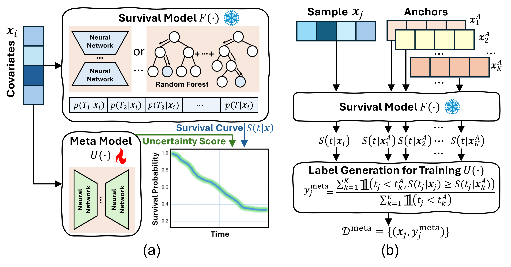

# SurvUnc: A Meta-Model Based Uncertainty Quantification Framework for Survival Analysis
 

## Requirements

To install requirements:

```setup
python=3.8.18
pytorch=1.10.1
pandas==2.0.3
scikit-learn==1.3.2
scikit-survival==0.22.2
```

## Data Downloading \& Processing
* We have provided FLCHAIN and SUPPORT datasets in `./dataset`

* For SAC3 dataset, please run the section `Synthetic Dataset Generation` in `./0_data.ipynb`

* For SEER-BC dataset, please refer to [SurvTRACE](https://github.com/RyanWangZf/SurvTRACE) for downloading and processing. We provide processing files in `./dataset/seer_bc`

* Dataset split and processing steps are implemented in `./0_data.ipynb`

## Pretrain Survival Models
* To pretrain a survival model ``{model}`` on a dataset ``{dataset}``, execute the following command:
  - **Model options**: `DeepSurv`, `DeepHit`, `DSM`, `RSF`
  - **Dataset options**: `flchain`, `support`, `seer_bc`, `sac3`

```python
python main.py --dataset {dataset} --model {model} --training
```
* We provide the pretrained models on FLCHAIN and SUPPORT datasets in `./survival_model_weights`

## Meta-model Training
* Select anchors from data, by executing the following command:
```python
python 1_anchor_selection.py --dataset {dataset} --model {model}
```
* Produce the meta-model training set by executing the following command:
```python
python 2_metaset_generate.py --dataset {dataset} --model {model}
```
* Train the meta-model by executing the following command:
  - **Meta-model options**: `MLP`, `RF`
```python
python 3_metamodel_train.py --dataset {dataset} --model {model} --meta_model {meta_model}
```

## Evaluation
* To conduct evaluation, execute the following command:
```python
python 4_evaluation.py --dataset {dataset} --model {model} --meta_model {meta_model}
```


  ## Reference

  ```latex
  @inproceddings{liu2025survunc,
  	title 	  = {SurvUnc: A Meta-Model Based Uncertainty Quantification
Framework for Survival Analysis},
  	author	  = {Liu, Yu and Tao, Weiyao and Xia, Tong and Knight, Simon and Zhu, Tingting},
  	booktitle = {Proceedings of the 31st ACM SIGKDD Conference on Knowledge Discovery and Data Mining,},
  	year      = {2025},
  }
  ```